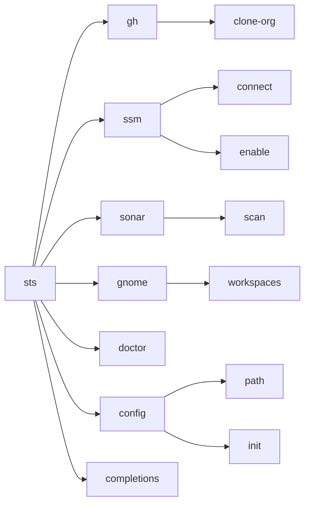
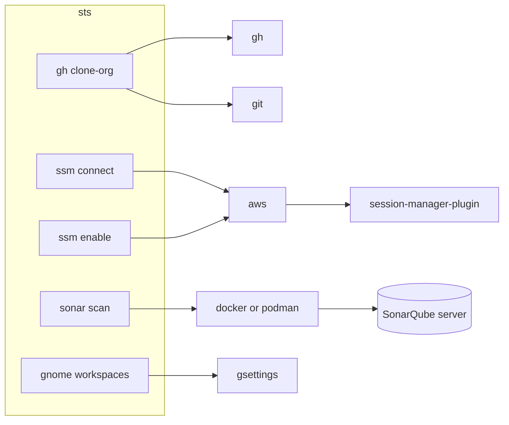
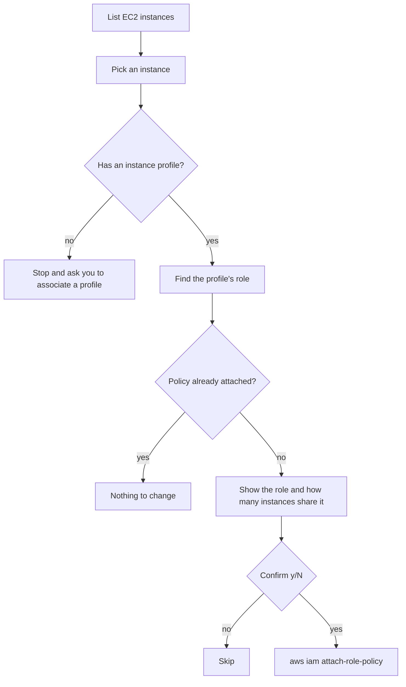
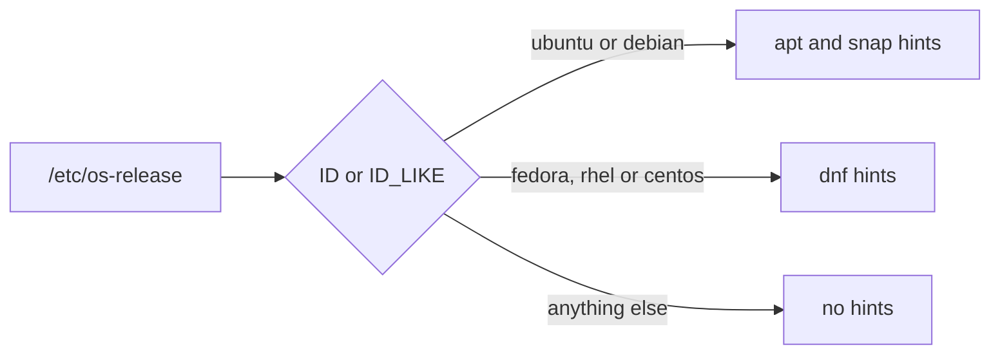
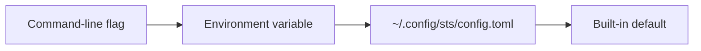
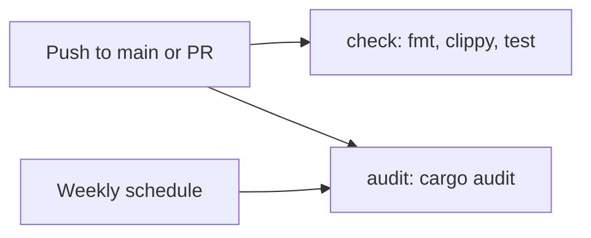
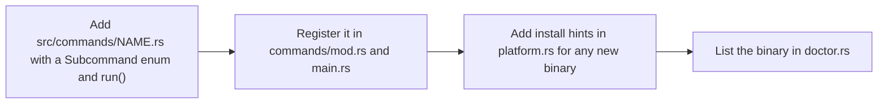

# sts

`sts` is a utility CLI that automates day-to-day company work. It runs on Ubuntu and Fedora.

## Quickstart

```sh
cargo install --path . --locked   # installs ~/.cargo/bin/sts
sts doctor                        # checks tools, prints apt or dnf commands
sts config init                   # creates ~/.config/sts/config.toml
sts --help
```

Shell completion for zsh:

```sh
mkdir -p ~/.zfunc && sts completions zsh > ~/.zfunc/_sts
# Add `fpath=(~/.zfunc $fpath)` before `compinit` in ~/.zshrc.
```

## Commands



| Command | Replaces | What it does |
| --- | --- | --- |
| `sts gh clone-org [ORG]` | `clone-org.sh` | It clones every repository of an organization in parallel. It pulls repositories that are already cloned. |
| `sts ssm connect` | `connect-ec2-ssm.sh` | It lets you pick an EC2 instance and opens an SSM shell on it. |
| `sts ssm enable` | `list-ec2-add-ssm.sh` | It attaches `AmazonSSMManagedInstanceCore` to an instance role. This command writes to IAM. |
| `sts sonar scan [PATH]` | `sonarqube-scan.sh` | It asks for the server URL, project path, project key and token, then scans the project with the SonarQube scanner in a container. |
| `sts gnome workspaces [NAMES]` | `workspace-conf.sh` | It sets the GNOME workspace names. |
| `sts doctor` | | It checks the required tools and prints install commands for your distro. |

Every command has `--help`.

## What each command calls

`sts` drives the official CLIs. It reuses their logins, profiles and SSO sessions.



`ssm enable` changes IAM, so it looks before it writes:



## Ubuntu and Fedora



| Topic | Ubuntu | Fedora |
| --- | --- | --- |
| Install hints | `apt`, plus `snap` for the AWS CLI | `dnf` |
| AWS CLI v2 | `snap install aws-cli --channel=v2/stable` | `dnf install awscli2` |
| Container engine | Docker | Podman. `sts` adds `--userns=keep-id` so the scanner can write its work folder. |
| SELinux | It is usually off. | It is enforcing. `sonar scan` adds `:z` to the mount and refuses `/` and `$HOME`. |
| Rust toolchain | Use rustup, because apt ships an old rustc. | `dnf install cargo` works. |

## Config

`sts` uses the first value it finds, from left to right.



| Config key | Flag | Environment variable |
| --- | --- | --- |
| `aws.region` | `-r, --region` | `AWS_REGION` |
| `aws.profile` | `-p, --profile` | `AWS_PROFILE` |
| `github.org` | `[ORG]` | |
| `sonar.host_url` | `--host-url` | `SONAR_HOST_URL` |
| `sonar.image` | `--image` | `SONAR_SCANNER_IMAGE` |
| `sonar.engine` | `--engine` | |
| `gnome.workspaces` | `[NAMES]` | |

`sts sonar scan` asks for each value that is not passed as a flag, and the environment and the config file prefill those prompts. Without a terminal, it uses those values directly and requires `--project-key`.

`STS_CONFIG` points `sts` at a different config file. See [config.example.toml](config.example.toml) for every key.

Company values such as server URLs and regions belong in the config file, not in this repository. Secrets never go in either place. The SonarQube token comes from `SONAR_TOKEN` or from a hidden prompt.

## Development

```sh
just ci           # fmt check, clippy and tests, as CI runs them
just run doctor   # runs sts from source
just --list       # lists every recipe
```

CI runs on every push to `main` and on every pull request:



```text
src/
  main.rs        CLI definition and dispatch
  config.rs      config file and `sts config`
  platform.rs    distro detection, install hints, container engine
  run.rs         helpers that run external commands
  commands/      one module per command group
```

To add a command group:



## Roadmap

- `sts vpn` will manage the company FortiClient SSL VPN.
